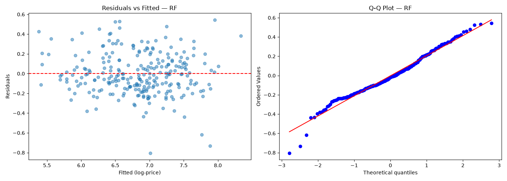
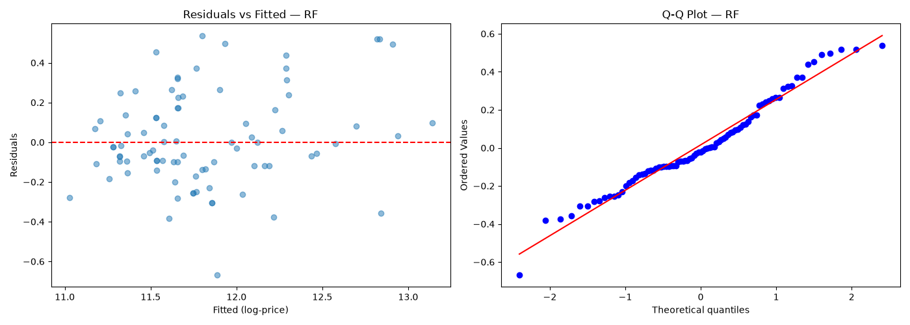
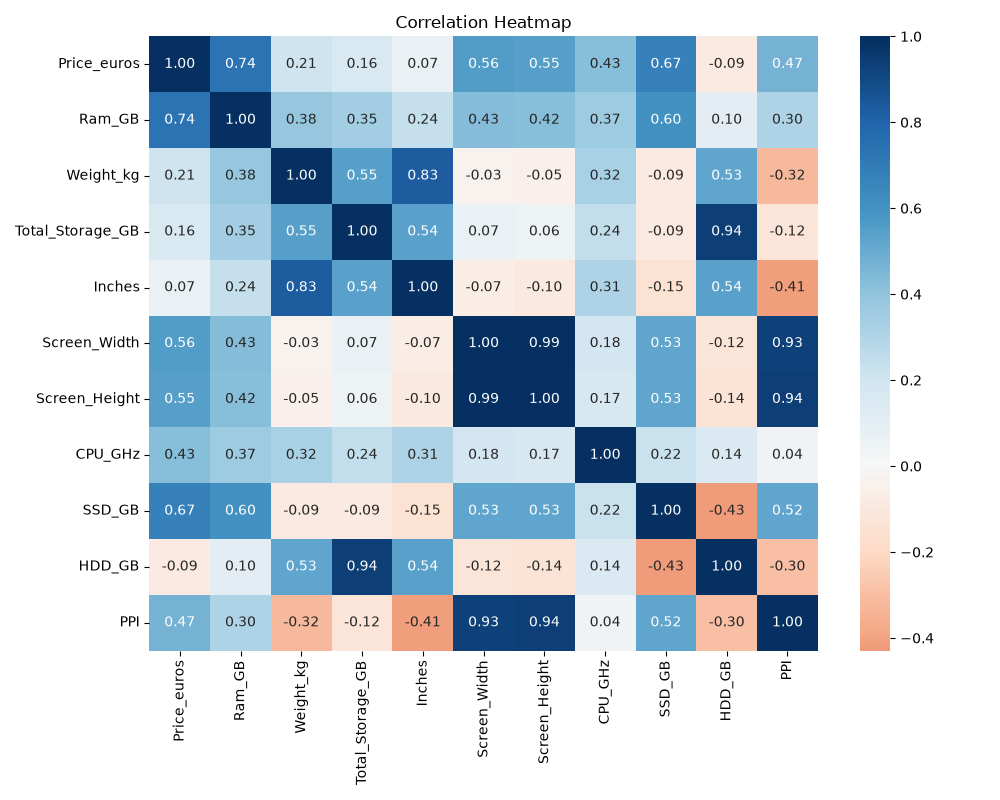
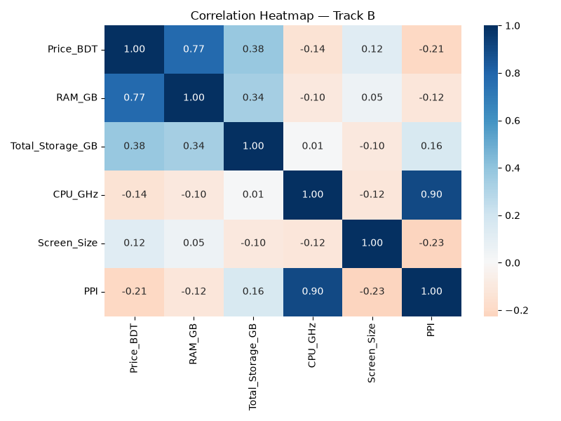
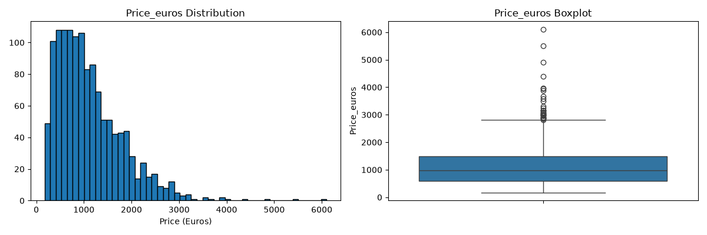
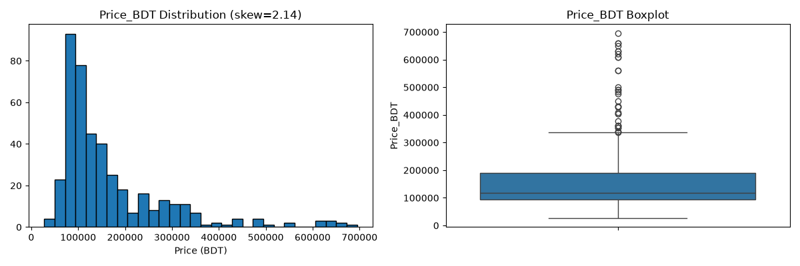

<div align="center">

# 💻 Laptop Price Regression Pipeline

### Turning messy spec strings into price predictions — two datasets, two markets, one pipeline design.

<p>


</p>

<p>


</p>

</div>

<br>

> Two independent regression tracks — a clean Kaggle dataset (Euros) and a hand-scraped Bangladeshi market dataset (BDT) — cleaned, explored, engineered, and modeled end-to-end with zero manual intervention.

<br>

## 📑 Contents

- [Overview](#-overview)
- [Project Structure](#️-project-structure)
- [Pipeline Stages](#-pipeline-stages)
- [Getting Started](#-getting-started)
- [Cleaning Decisions](#-key-cleaning-decisions)
- [Results](#-results)
- [Failure Analysis](#-where-the-models-fail)
- [Scraper](#️-track-b-scraper)
- [Tech Stack](#️-tech-stack)

<br>

## 📌 Overview

<table>
<tr>
<td width="50%" valign="top">

### 🇪🇺 Track A — Kaggle
- **1,303** listings
- Prices in **Euros**
- Clean, structured, **0% missing**
- Challenge: parsing dense compound spec strings

</td>
<td width="50%" valign="top">

### 🇧🇩 Track B — Self-Scraped
- **218** unique listings (169 usable)
- Prices in **BDT**
- Noisy, high missingness, out-of-stock rows
- Source: `startech.com.bd` + `ryans.com`

</td>
</tr>
</table>

The shared challenge: raw strings like `"IPS Panel Retina Display 2560x1600"` or `"256GB SSD + 1TB HDD"` have to become structured numeric features before any model can touch them.

<br>

## 🗂️ Project Structure

```
Regression Pipeline Project/
├── data/
│   ├── track_a/
│   │   ├── raw/laptop_price.csv              # Original Kaggle CSV
│   │   └── cleaned/                          # Cleaned data + EDA plots
│   └── track_b/
│       ├── raw/track_b_listings.csv          # Scraped listings
│       ├── raw/scrape_metadata.json          # Scrape run metadata
│       └── cleaned/                          # Cleaned data + EDA plots
├── notebooks/
│   ├── track_a_pipeline.ipynb                # Full Track A pipeline
│   └── track_b_pipeline.ipynb                # Full Track B pipeline
├── scripts/
│   └── scrape_track_b.py                     # Web scraper
├── report/
│   └── report_draft.md                       # Full written report
├── requirements.txt
└── run_pipeline.bat                          # One-click Windows launcher
```

<br>

## 🔄 Pipeline Stages

<table>
<tr><td width="60px" align="center"><h3>1</h3></td><td><b>Data Cleaning</b> — parse compound strings (RAM, storage, resolution, CPU, GPU), drop low-value columns, document every imputation, analyze outliers.</td></tr>
<tr><td align="center"><h3>2</h3></td><td><b>Exploratory Data Analysis</b> — target distribution, numeric/categorical relationships to price, correlation structure.</td></tr>
<tr><td align="center"><h3>3</h3></td><td><b>Feature Engineering</b> — log-transform the target, one-hot encode categoricals, derive PPI / total storage / GPU index.</td></tr>
<tr><td align="center"><h3>4</h3></td><td><b>Modeling</b> — OLS baseline, cross-validated Ridge & Lasso, Random Forest as a stretch model.</td></tr>
<tr><td align="center"><h3>5</h3></td><td><b>Evaluation</b> — held-out test metrics, residual diagnostics, explicit failure-mode analysis.</td></tr>
</table>

<br>

## 🚀 Getting Started

**Prerequisites:** Python 3.10+, pip

```bash
git clone https://github.com/ItachiUchiha275/laotop-price-regression.git
cd laotop-price-regression
pip install -r requirements.txt
```

**Run everything (Windows):**

```bash
.\run_pipeline.bat            # uses cached data
.\run_pipeline.bat scrape     # re-scrapes Track B first
```

This checks dependencies, optionally re-scrapes Track B, then executes both notebooks end-to-end via `nbconvert`.

**Run manually (any OS):**

```bash
jupyter notebook notebooks/track_a_pipeline.ipynb
jupyter notebook notebooks/track_b_pipeline.ipynb
```

<br>

## 🧹 Key Cleaning Decisions

| Field | Raw format | Parsed to |
|:--|:--|:--|
| `Ram` | `"8GB"`, `"16GB LPDDR5x"` | `Ram_GB` *(int)* |
| `Weight` | `"1.37kg"` | `Weight_kg` *(float)* |
| `Memory` / `Storage` | `"256GB SSD + 1TB HDD"` | `SSD_GB`, `HDD_GB` |
| `ScreenResolution` / `Display` | `"IPS Panel ... 2560x1600"` | `Is_IPS`, `Is_Touchscreen`, `Screen_Width/Height` |
| `Cpu` / `Processor` | `"Intel Core i5 2.3GHz"` | `CPU_Brand`, `CPU_GHz` |
| `Gpu` | `"NVIDIA GeForce GTX 1050"` | `GPU_Brand` |
| `Price(BDT)` | `"145,000৳"`, `"Out Of Stock"` | `Price_BDT` *(int, OOS rows dropped)* |

> 🎯 **Outliers were retained on both tracks** — they're genuine premium hardware (Razer Blade, Alienware, RTX-5090 builds), not data errors. The right-skew is instead handled by log-transforming the target. Track B was deduplicated by `Product_URL` (237 → 218 unique).

<br>

## 📊 Results

<table>
<tr><td align="center" width="50%"><b>🇪🇺 Track A</b><br><sub>Price in Euros</sub></td>
<td align="center" width="50%"><b>🇧🇩 Track B</b><br><sub>Price in BDT</sub></td></tr>
<tr>
<td>

| Model | R² (log) | RMSE (€) |
|:--|:--:|:--:|
| OLS | 0.788 | 340 |
| Ridge | 0.789 | 331 |
| Lasso | 0.789 | 335 |
| 🏆 **Random Forest** | **0.866** | **316** |

</td>
<td>

| Model | R² (log) | RMSE (৳) |
|:--|:--:|:--:|
| Ridge | 0.823 | 53,573 |
| Lasso | 0.806 | 65,527 |
| Random Forest | 0.838 | 59,230 |
| 🏆 **OLS** | **0.831** | **54,014** |

</td>
</tr>
</table>

<div align="center">

**Track A → Random Forest wins (R² = 0.87)** · **Track B → OLS wins (R² = 0.83)**

</div>

All models trained on an 80/20 split (`random_state=42`), features standardized on train only, evaluated on the log-transformed target and back-transformed for interpretable € / ৳ error.

### 📈 Diagnostics

<table>
<tr>
<td align="center" width="50%"><b>Track A</b></td>
<td align="center" width="50%"><b>Track B</b></td>
</tr>
<tr>
<td></td>
<td></td>
</tr>
<tr>
<td></td>
<td></td>
</tr>
<tr>
<td></td>
<td></td>
</tr>
</table>

<details>
<summary>🔎 More plots (boxplots, scatter matrix, log transform, numeric distributions)</summary>
<br>

**Track A:** `category_boxplots.png` · `scatter_matrix.png` · `log_transform.png` · `numeric_distributions.png` (in `data/track_a/cleaned/`)

**Track B:** `category_boxplots.png` · `scatter_matrix.png` · `log_transform.png` · `numeric_distributions.png` (in `data/track_b/cleaned/`)

</details>

<br>

## 🔍 Where the Models Fail

| Issue | Impact |
|:--|:--|
| **High-end laptops underpredicted** | Ultra-premium units (>€4,000 / >৳500,000) are <3% of data — models regress toward the mean |
| **Conflicting spec signals** | e.g. a 4K display + budget CPU + no dedicated GPU confuses the model |
| **Brand premium invisible** | `Company` dropped from Track A (19 levels → overfitting); Apple/Razer premiums uncaptured |
| **GPU brand-only, not tier** | RTX 3050 and RTX 4090 look identical to the model — likely the biggest untapped signal |
| **Track B is data-scarce** | 169 usable rows → ~34-row test set → high metric variance |
| **85% GPU missing (Track B)** | Rarely listed on category pages |

📄 Full write-up with proposed fixes (per-product scraping, GPU tier indexing, target-encoded brand): [`report/report_draft.md`](report/report_draft.md)

<br>

## 🕸️ Track B Scraper

`scripts/scrape_track_b.py` scrapes `ryans.com` and `startech.com.bd`, respecting `robots.txt` with a 1.5s delay between requests. Output goes straight to `data/track_b/raw/track_b_listings.csv` — no raw HTML retained.

```bash
python scripts/scrape_track_b.py
```

<br>

## 🛠️ Tech Stack

<p>


</p>

<br>

<div align="center">

## 📄 License

Released under the **MIT License**.

</div>
