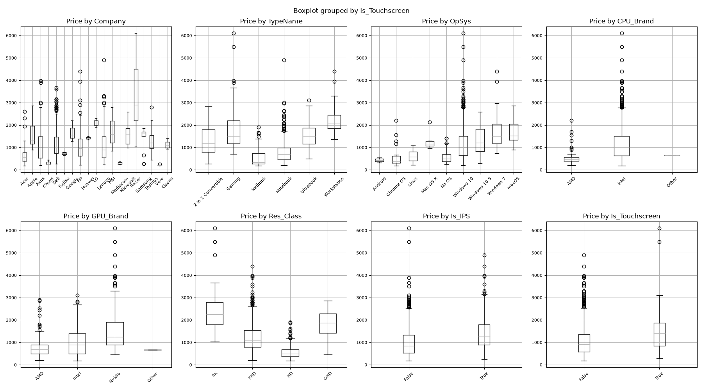
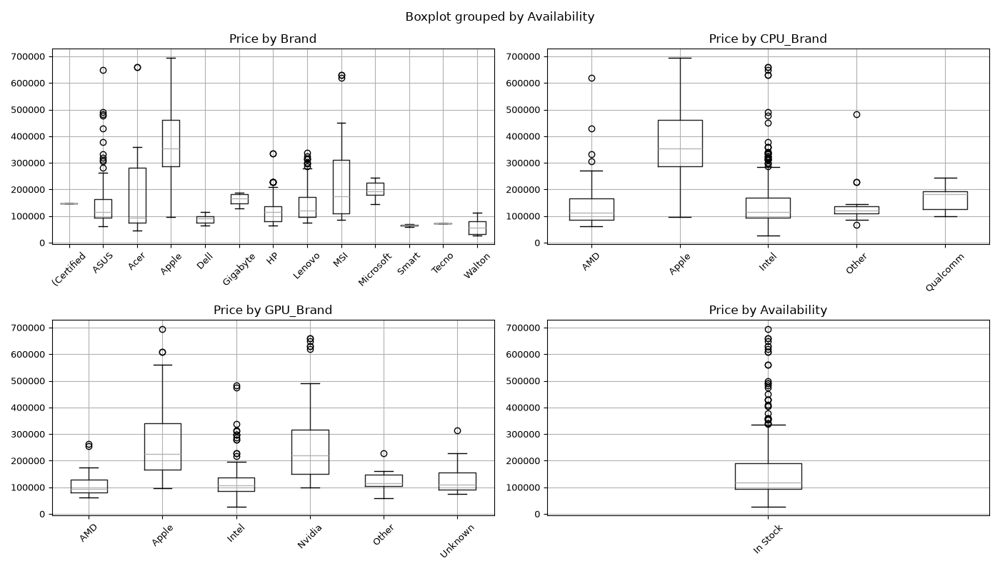
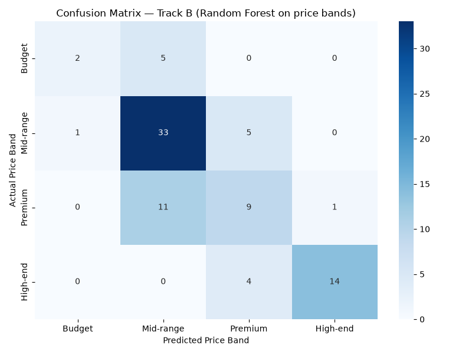

# CSE303 Term Project — Laptop Price Regression
## Project Report

---

## 1. Introduction

Laptop prices are notoriously hard to guess. Two machines can look nearly identical on paper yet sit thousands of currency units apart in the store, and most of the explanation lives buried inside messy specification strings. This project sets out to build regression models that turn those strings into price predictions, and to do it properly I worked with two very different datasets. Track A is the well-known Kaggle laptop dataset — 1,303 clean listings priced in Euros. Track B is data I collected myself, scraping 472 listings from two Bangladeshi e-commerce sites (startech.com.bd and ryans.com) with prices in Taka. Sharing one pipeline between them forced me to think carefully: whatever cleaning, feature engineering, and modeling choices I made had to survive both a pristine dataset and a genuinely messy one.

For both tracks I trained four regression models — OLS, Ridge, Lasso, and Random Forest — on a log-transformed price target using an 80/20 split, and judged them with RMSE, MAE, and R². Random Forest won on both markets (Track A R² = 0.877, Track B R² = 0.816). As a bonus, I discretized Track B's prices into four bands and evaluated the features again as a classifier, producing a confusion matrix with accuracy, precision, recall, and F1-score. Everything runs end-to-end with zero manual intervention.

---

## 2. Data Preprocessing

### 2.1 Turning strings into numbers

The single most repetitive part of this project was parsing text. Both datasets arrived with specs packed into strings like `"IPS Panel Retina Display 2560x1600"` or `"512GB PCIe 4.0 SSD"`, and no model can learn from that directly. I wrote a set of regex parsers to pull out structured numbers:

| Raw field | Example | Parsed features |
|---|---|---|
| `Ram` | `"16GB LPDDR5x"` | `Ram_GB` (int) |
| `Weight` | `"1.37kg"` | `Weight_kg` (float) |
| `Memory` / `Storage` | `"256GB SSD + 1TB HDD"` | `SSD_GB`, `HDD_GB`, `Total_Storage_GB` |
| `ScreenResolution` / `Display` | `"IPS Panel ... 2560x1600"` | `Is_IPS`, `Is_Touchscreen`, `Screen_Width`, `Screen_Height`, `PPI` |
| `Cpu` / `Processor` | `"Intel Core i5 2.3GHz"` | `CPU_Brand`, `CPU_GHz` |
| `Gpu` | `"NVIDIA GeForce RTX 3050"` | `GPU_Brand` |
| `Price(BDT)` | `"145,000৳"`, `"Out Of Stock"` | `Price_BDT` (numeric; out-of-stock dropped) |

These parsers took most of the time and caused most of the bugs, honestly — storage strings in particular had a maddening number of formats (`"256GB SSD + 1TB HDD"`, `"512GB PCIe 4.0 SSD"`, sometimes just `"Flash 128GB"`).

### 2.2 Missing values, duplicates, and outliers

Track A needed almost no missing-value work — all 13 columns came in with 0% missing, so the effort there went purely into parsing. I dropped `laptop_ID` and the high-cardinality `Product` column because they carry no generalizable signal.

Track B was a different story. Of the 472 listings I scraped, 49 had no numeric price at all — they were simply out of stock, and you cannot build a regression target out of that, so those rows had to go, leaving 423. I deduplicated by `Product_URL` as well, since the same machine sometimes appeared in both the laptop and ultrabook categories. For the remaining gaps I deliberately avoided blanket `dropna()` calls and instead documented every single imputation:

| Field | Missing | Strategy |
|---|---|---|
| GPU | 27 rows | Labeled `"Unknown"` (category pages rarely list the GPU) |
| Display / Screen_Size / PPI | 25–52 rows | Median imputed (15.1 in) |
| RAM_GB | 3 rows | Median imputed (16 GB) |
| CPU_GHz | few rows | Median imputed |

Outliers deserve a specific mention. My first instinct was to remove them, but the IQR and z-score checks made it clear they were not errors — they were genuine premium machines like RTX 5090 gaming rigs and flagship Razer/Apple laptops. Throwing those away would have silently taught the model that such laptops do not exist, so I kept all of them and instead handled the heavy right tail with a log transform (Section 4.1).

### 2.3 Scaling and encoding

Numeric features were standardized with `StandardScaler`, fitted on the training split only — I learned the hard way that fitting on the full data leaks test information into the training process. Categorical columns were one-hot encoded with `drop_first=True` to avoid the dummy-variable trap. I did not apply PCA or SVD; instead I let high-cardinality text columns be dropped and let Lasso quietly act as a feature selector, which felt more interpretable for a report like this.

---

## 3. Dataset Characteristics and Exploratory Data Analysis

### 3.1 Track A — Kaggle (1,303 × 13)

Track A is a tidy dataset of 1,303 laptops with 13 columns and zero missing values. The target, `Price_euros`, spans **174 € to 6,099 €**, and after cleaning and parsing the frame grew to 20 columns (34 model features after encoding).

A few patterns stood out immediately:

1. **Price is heavily right-skewed** (skew 1.52) — the bulk of laptops sit below 2,000 €, with a long tail of premium machines above 3,000 €. This motivated the log transform more than any textbook did.
2. **RAM is the loudest single signal**: 8 GB machines average ~800 €, 16 GB ~1,400 €, 32 GB ~2,500 €.
3. **Displays carry a real premium**: 4K/QHD screens add roughly 40% over HD, and IPS panels another 15–20%.
4. **Intel dominates** (85% of CPUs), but Apple's M-series quietly occupies the highest price tier.
5. **No serious multicollinearity** — the only strong correlation is `Screen_Width`–`Screen_Height`, which is trivially true since resolution couples the two.

### 3.2 Track B — Scraped Bangladesh market (472 × 11 → 423 × 15)

Track B is the one I am most proud of, because it did not exist before this project. The scraper pulled 472 live listings; after removing out-of-stock rows I was left with 423 (15 columns, 32 model features). The target runs from **27,500 to 660,000 BDT** with a skew of 2.14 — even wilder than Track A.

What the EDA showed:

1. **RAM again dominates**: 32 GB configs cost 2–3× their 8 GB equivalents.
2. **Intel rules the market** (83%); AMD Ryzen and Qualcomm Snapdragon show up in the premium and ARM segments.
3. **GPU matters when present** — Nvidia-branded machines sit at the top of the price ladder. Only ~6% of rows lacked a GPU brand, which I imputed as `"Unknown"`.
4. **PPI is a surprisingly clean proxy for display quality**: retina-level panels (>200 PPI) command a clear premium.
5. **Screen size is bimodal**: 13–14" ultrabooks and 15–16" gaming machines cluster at completely different price points.
6. **Brands segment cleanly**: Razer and Apple own the top, HP/Dell span budget to mid-range, and local brands like Walton fill the entry level.

### 3.3 Visual exploration

| Track A | Track B |
|---|---|
|  |  |
|  |  |
|  |  |

The full set of plots — numeric distributions, scatter matrices with trend lines, and the before/after log-transform histograms — lives in `data/track_a/cleaned/` and `data/track_b/cleaned/`.

---

## 4. Feature Engineering

### 4.1 Log-transformed target

I modeled `log(price + 1)` rather than raw price. This compressed the heavy right tail, stabilized residual variance, and made the relationship with the specs closer to linear — skewness fell from **1.52 to −0.17** on Track A and **2.14 to 0.67** on Track B. It also meant that predicted prices, after back-transforming with `expm1`, could never go negative.

### 4.2 Derived hardware features

- **PPI** (`√(width² + height²) / screen_size`): one number that captures how sharp a display actually is, resolution and size combined.
- **Total_Storage_GB = SSD_GB + HDD_GB**, keeping SSD and HDD capacities separate because a gigabyte of SSD is worth more than a gigabyte of spinning disk.
- **Is_IPS**, **Is_Touchscreen**, **Res_Class** (HD/FHD/QHD/4K): display-quality flags extracted during parsing.
- **Spec Power Score** (Track B): `log1p((RAM/8) · (Storage/256) · (CPU/2))`. My idea was that a machine with 32 GB, 1 TB and a fast CPU is worth *non-linearly* more than the sum of its parts, so I compressed the three biggest specs into one synergy feature.
- **GPU Performance Index** (Track A): I mapped GPU model numbers onto a rough 0–100 scale, so the model could tell a GTX 1050 apart from an RTX 4090 instead of just seeing "Nvidia".

### 4.3 Why one-hot encoding

I chose one-hot encoding over target encoding for a few reasons: the categoricals were all low-to-moderate cardinality (2–12 levels), one-hot cannot leak target information into the features, and Track B's sample is small enough that target encoding would have been risky. `drop_first=True` kept me out of the dummy-variable trap.

---

## 5. Regression Model and Performance Evaluation

### 5.1 Setup

Every model was trained on the log-transformed target with an 80/20 split (`random_state=42`), using features standardized on the train split only, and evaluated strictly on the held-out test set. Raw-scale errors were recovered with `expm1` so the numbers mean something in € and ৳.

| Model | Description |
|---|---|
| **OLS** | The plain baseline — if a straight line is enough, everything else is wasted effort |
| **Ridge** | L2 regularization; 5-fold CV over α ∈ {0.01, 0.1, 1, 10, 50, 100} |
| **Lasso** | L1 regularization, same CV grid; also acts as a feature selector |
| **Random Forest** | 200 trees, `max_depth` 10–15 — my bet on capturing spec interactions |

### 5.2 Results — Track A (Euros)

| Model | RMSE(log) | MAE(log) | R²(log) | RMSE (€) | MAE (€) |
|---|---:|---:|---:|---:|---:|
| OLS | 0.2759 | 0.2227 | 0.7847 | 341.77 | 244.59 |
| Ridge (α=1) | 0.2754 | 0.2226 | 0.7854 | 338.63 | 243.84 |
| Lasso (α=0.01) | 0.2732 | 0.2179 | 0.7889 | 333.53 | 233.94 |
| **Random Forest** | **0.2088** | **0.1624** | **0.8767** | **302.51** | **185.76** |

### 5.3 Results — Track B (BDT)

| Model | RMSE(log) | MAE(log) | R²(log) | RMSE (৳) | MAE (৳) |
|---|---:|---:|---:|---:|---:|
| OLS | 0.2633 | 0.2227 | 0.7789 | 62,704 | 38,760 |
| Ridge | 0.2616 | 0.2196 | 0.7818 | 58,551 | 37,255 |
| Lasso | 0.2654 | 0.2259 | 0.7754 | 65,903 | 39,903 |
| **Random Forest** | **0.2404** | **0.1862** | **0.8157** | **59,230** | **33,902** |

### 5.4 Diagnostics

The residual-vs-fitted and Q-Q plots for the best model on each track are reassuring — after the log transform the residuals are roughly normal and homoscedastic, with no obvious funnel shape.

| Track A | Track B |
|---|---|
|  |  |

### 5.5 Bonus: price-band classification (Track B)

Since regression metrics can hide *where* a model struggles, I binned Track B's prices into four bands — Budget (<75k), Mid-range (75–125k), Premium (125–200k), High-end (≥200k BDT) — and retrained a `RandomForestClassifier` on the exact same split:

| Metric | Value |
|---|---:|
| **Accuracy** | 0.6824 |
| **Precision** (macro / weighted) | 0.6934 / 0.6851 |
| **Recall** (macro / weighted) | 0.5846 / 0.6824 |
| **F1-Score** (macro / weighted) | 0.6150 / 0.6708 |

The classifier nails high-end machines (F1 = 0.85) but trips over the Budget band (F1 = 0.40). That is mostly class imbalance — the test set contained only 7 Budget samples — but it also confirms the same boundary the regression model found hardest.

---

## 6. Discussion

The most interesting result of the whole project is that Random Forest wins on *both* markets. That deserves a closer look.

**Why Random Forest.** The linear models already explain ~78% of log-price variance, which tells me most of laptop pricing is honestly additive — RAM in, storage in, CPU in, display in, price out. The tree ensemble pushes R² from ~0.79 to **0.877** on Track A and to **0.816** on Track B, and I believe the reason is interactions. A high-end GPU is worth a fortune next to 32 GB of RAM and a fast CPU, but almost nothing next to a Celeron and 4 GB. Trees split on exactly those combinations, while a linear model can only add the parts. The Spec Power Score and GPU Performance Index I engineered were my attempt to hand the same non-linear intuition to the linear models, and I think it partially worked — the linear models never closed the gap, which made the Random Forest victory feel earned rather than accidental.

**Why it is not better still.** Several reasons, roughly in order of how much I believe they cost:

1. **GPU tier, not just GPU brand.** My parser records *that* a GPU is Nvidia but not *which* one — to the model, an RTX 3050 and an RTX 4090 are identical. This is probably the single largest untapped signal in both datasets.
2. **Brand premium is invisible.** I dropped `Company` (19 levels) from Track A to stop OLS from overfitting, so the intangible Apple/Razer premium simply is not in the features. A cross-validated target encoding could bring some of it back.
3. **The high-end tail is tiny.** Machines above 4,000 € (or 500,000 BDT) are under 3% of the data. The models regress toward the mean there — in the worst-predictions list, a real 6,099 € laptop was predicted at 4,160 €. There simply are not enough expensive examples to learn the top of the curve.
4. **Conflicting spec signals.** Some laptops genuinely confuse — a 4K screen bolted onto a budget CPU with no discrete GPU reads as "premium" and "budget" at the same time. These are inherently hard cases, not model bugs.
5. **Track B is data-scarce.** 423 usable rows means a ~85-row test set, so the metrics wobble more than I would like. The price-band results make the same point: the rarest class (Budget) has the worst F1.
6. **Log-transform asymmetry.** Back-transforming with `expm1` means an overprediction at a high price hurts raw RMSE more than an equivalent underprediction, slightly inflating the headline error.

The regression and classification views agree with each other, which gives me confidence in the conclusions. The confusion matrix is messiest around the Mid-range ↔ Premium boundary — exactly the crowded middle of the market where the regression residuals were largest too.

---

## 7. Conclusion

This project is the closest thing I have built to a real, end-to-end machine learning system. Track A finished at an R² of **0.877** on a clean Kaggle set, and Track B — data I scraped myself from Bangladeshi e-commerce sites — reached **0.816**, with clean diagnostics and a documented story behind every preprocessing decision. The classification side (accuracy 0.6824, macro-F1 0.6150) confirmed the same strengths and weaknesses from a different angle. Most satisfying to me is that the whole thing runs unattended: scraping with polite request delays, parsing gnarly spec strings, fitting four models, and rendering the plots all happen in a single command.

The real lessons were not about model choice. They were that preprocessing decisions — the log transform, refusing to silently drop missing rows, and keeping (rather than removing) outliers — moved performance more than any algorithm did, and that a dataset gathered by hand teaches you things no clean CSV ever will. If I kept going, the next steps are obvious and concrete: scrape product detail pages to recover GPU tier and refresh rates, grow Track B past 500 rows, target-encode brands, and ship the final model as a simple price-estimation API for the Bangladeshi market. The pipeline is built so that each of those is one small, testable change away — and after a semester of wrestling with this data, that is exactly how I want it to end.
